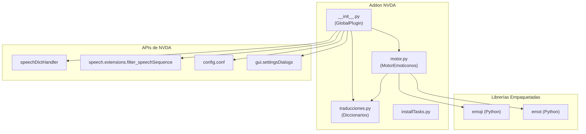
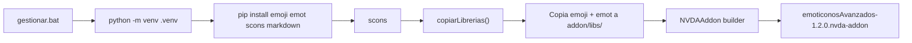

# 📋 EmoticonosAvanzados para NVDA — Planning Completo del Proyecto

> [!NOTE]
> Este documento está diseñado para servir como referencia exhaustiva para cualquier IA agéntica o desarrollador que necesite retomar el proyecto. Contiene todo el contexto necesario: arquitectura, decisiones técnicas, estado actual, problemas resueltos y convenciones del código.

---

## 1. Visión General del Proyecto

**Nombre**: EmoticonosAvanzados  
**Tipo**: Complemento (add-on) para NVDA (lector de pantallas)  
**Versión actual**: 1.3.0  
**Autor**: Héctor J. Benítez Corredera (`xebolax@gmail.com`)  
**Licencia**: GPL v2  
**Compatibilidad**: NVDA 2024.1 → 2026.1  
**Repositorio**: `https://github.com/hxebolax/emoticonosAvanzados`  
**Idioma base**: Español (`es`)  

### Objetivo

Proporcionar a usuarios ciegos y con baja visión un control avanzado sobre cómo NVDA anuncia los emojis Unicode y emoticonos clásicos ASCII. El complemento ofrece cuatro modos de operación, traducción extensa al español, y configración profunda desde el panel de opciones nativo de NVDA.

---

## 2. Arquitectura del Proyecto

### Estructura de Archivos

```
EmoticonosNVDA/
├── addon/                              # Contenido del .nvda-addon
│   ├── globalPlugins/
│   │   └── emoticonosAvanzados/
│   │       ├── __init__.py             # Plugin principal (727 líneas)
│   │       ├── motor.py                # Motor de detección (454 líneas)
│   │       └── traducciones.py         # Diccionarios de traducción (1393 líneas)
│   ├── libs/                           # Librerías empaquetadas (emoji, emot)
│   │   ├── emoji/                      # Librería emoji (copiada del venv)
│   │   └── emot/                       # Librería emot (copiada del venv)
│   ├── doc/
│   │   ├── es/                         # Documentación en español
│   │   └── style.css                   # Estilos para la doc HTML
│   ├── installTasks.py                 # Tareas de instalación/actualización
│   └── manifest.ini                    # Manifiesto del addon (generado por SCons)
├── adjuntos/                           # Material de referencia y desarrollo
│   ├── AddonTemplate/                  # Template oficial de addons NVDA
│   ├── ejemplo.py                      # Código de referencia
│   ├── emoji/                   # Código fuente librería emoji
│   ├── emot/                    # Código fuente librería emot
│   ├── emoticons/                 # Addon emoticons original (referencia)
│   ├── nvda/                           # Fuentes de NVDA (referencia)
│   └── zEmoticonos/                    # Versión anterior/prototipo
├── site_scons/                         # Herramientas SCons para NVDA
├── buildVars.py                        # Variables de compilación
├── sconstruct                          # Archivo SCons principal
├── gestionar.bat                       # Script de gestión (venv + compilación)
├── manifest.ini.tpl                    # Template del manifiesto
├── manifest-translated.ini.tpl         # Template del manifiesto traducido
├── requirements.txt                    # Dependencias: emoji, emot
├── pyproject.toml                      # Config de Ruff y Pyright
├── readme.md                           # Documentación del usuario
├── changelog.md                        # Registro de cambios
├── mastodon_post.md                    # Post de anuncio en Mastodon
├── COPYING.txt                         # Licencia GPL v2
├── style.css                           # CSS para documentación
└── .gitignore / .gitattributes         # Config de Git
```

### Diagrama de Componentes



---

## 3. Componentes Principales

### 3.1 `__init__.py` — Plugin Principal

**Responsabilidades:**
- Clase `GlobalPlugin`: punto de entrada del complemento en NVDA
- Gestión de modos de anuncio (desactivado, individual, agrupado, eliminado)
- Construcción y manejo del diccionario de habla temporal (`speechDictHandler`)
- Registro/desregistro del filtro de habla para modo agrupado
- Panel de configuración (`PanelConfiguracion` extends `SettingsPanel`)
- Menú en Herramientas de NVDA
- 3 scripts sin atajo predefinido (alternarModo, mostrarSimboloActual, analizarPortapapeles)
- Soporte para cambio de perfiles de configuración
- Decorador `deshabilitarEnModoSeguro`
- Sistema de logging propio con 4 niveles

**Constantes importantes:**
```python
MODO_DESACTIVADO = 0
MODO_INDIVIDUAL = 1
MODO_AGRUPADO = 2
MODO_ELIMINADO = 3

LOG_DESACTIVADO = 0
LOG_INFO = 1
LOG_DEBUG = 2
LOG_COMPLETO = 3
```

**Configuración (confspec):**
| Clave | Tipo | Default | Descripción |
|-------|------|---------|-------------|
| `modo` | integer | 0 | Modo de anuncio activo |
| `detectarEmojis` | boolean | True | Detectar emojis Unicode |
| `detectarEmoticonos` | boolean | True | Detectar emoticonos clásicos |
| `suprimirSimbolosNVDA` | boolean | False | Suprimir símbolos NVDA |
| `mostrarEnBraille` | boolean | False | Mostrar descripciones en línea Braille |
| `formatoDescripcion` | string | `"[{}]"` | Formato de la descripción |
| `ignorarMayusculas` | boolean | True | XD = xd |
| `usarLibreriaEmoji` | boolean | True | Activar librería emoji |
| `usarLibreriaEmot` | boolean | True | Activar librería emot |
| `usarTraduccionesManual` | boolean | True | Usar traducciones manuales |
| `prefijo` | string | `""` | Prefijo al anunciar |
| `separadorAgrupado` | string | `", "` | Separador en modo agrupado |
| `nivelLog` | integer | 0 | Nivel de registro |

**Mecanismo de funcionamiento por modo:**

| Modo | Mecanismo | Descripción |
|------|-----------|-------------|
| Individual | `speechDictHandler.SpeechDict` (temp) | Cada emoji → su descripción via regex |
| Agrupado | `speech.extensions.filter_speechSequence` | Intercepta secuencia de habla, cuenta repetidos |
| Eliminado | `speechDictHandler.SpeechDict` (temp) | Cada emoji → espacio vacío via regex |

### 3.2 `motor.py` — Motor de Detección

**Clase `MotorEmoticonos`:**
- Combina 3 fuentes de detección: librería `emoji`, librería `emot`, diccionarios manuales
- Prioridad de descripciones: manual → emoji (es) → emoji (en) → fallback
- Patrones regex precompilados para emoticonos clásicos
- Verificación de límites de palabra (`_validar_limites`) para evitar falsos positivos
- Normalización de claves para agrupación (case-insensitive)

**Métodos principales:**
- `detectar_emojis(texto)` → lista de resultados
- `detectar_emoticonos(texto)` → lista de resultados con boundary check
- `detectar_todo(texto)` → ambos combinados y ordenados
- `agrupar_resultados(resultados)` → conteo de repetidos
- `generar_texto_agrupado(texto, formato, separador)` → texto reescrito con conteos
- `obtener_todos_emojis()` → diccionario completo emoji→descripción

### 3.3 `traducciones.py` — Diccionarios

Contiene 3 diccionarios:

1. **`TRADUCCIONES_EMOTICONOS`** (~80 entradas): Mapa inglés→español de descripciones de emoticonos de la librería emot
2. **`TRADUCCIONES_EMOJIS_MANUAL`** (~1200+ entradas): Mapa emoji_char→descripción_español organizado por categorías:
   - Caras (sonrientes, afectuosas, lengua, manos, neutras, soñolientas, enfermas, preocupadas, enfadadas, fantasía)
   - Corazones (todos los colores + variantes)
   - Manos y gestos
   - Personas y profesiones
   - Animales (completo)
   - Comida y bebida (completo)
   - Viajes y transporte
   - Objetos y tecnología
   - Símbolos, señales, flechas
   - Eventos y celebración
   - Naturaleza y clima
   - Relojes y tiempo
   - Banderas (~50 países)
   - Zodíaco
   - Ropa y accesorios
   - Herramientas y hogar
   - Cuerpo humano
   - Seres fantásticos
   - Símbolos japoneses
3. **`EMOTICONOS_MANUALES`** (~70 entradas): Mapa emoticono_ascii→descripción_español (`:)`, `:D`, `XD`, `<3`, etc.)

---

## 4. Sistema de Compilación

### Flujo de Build



### `gestionar.bat` — Opciones

1. Crear entorno virtual + instalar dependencias
2. Compilar complemento (.nvda-addon)
3. Todo en uno (1 + 2)
4. Limpiar archivos generados
5. Generar archivo .pot para traducciones
6. Salir

### `sconstruct` — Detalles Técnicos

- Usa `site_scons` con herramientas `gettexttool` y `NVDATool` (template oficial de NVDA)
- Función `copiarLibrerias()`: copia `emoji` y `emot` desde `.venv/*/site-packages/` a `addon/libs/`, excluyendo `__pycache__`, `.pyc`, `.pyo`
- Genera `manifest.ini` desde template
- Convierte `readme.md` a HTML para documentación embebida
- Copia `style.css` a `addon/doc/`
- Soporte para traducciones (.po → .mo → manifest traducido)

### Dependencias

| Paquete | Uso | Empaquetada en addon |
|---------|-----|----------------------|
| `emoji` | Detección de emojis Unicode (5000+) | ✅ Sí, en `addon/libs/` |
| `emot` | Detección de emoticonos ASCII | ✅ Sí, en `addon/libs/` |
| `scons` | Sistema de compilación | ❌ Solo desarrollo |
| `markdown` | Conversión md→html para docs | ❌ Solo desarrollo |

### Manejo de libs empaquetadas

En `__init__.py` se agrega `addon/libs/` a `sys.path` temporalmente para importar las librerías. Después de importar, se limpia `sys.path`:

```python
_libsPath = os.path.join(..., "libs")
if os.path.isdir(_libsPath) and _libsPath not in sys.path:
    sys.path.insert(0, _libsPath)
    _libsPathAgregado = True

from .motor import MotorEmoticonos
from .traducciones import EMOTICONOS_MANUALES

if _libsPathAgregado and _libsPath in sys.path:
    sys.path.remove(_libsPath)
```

---

## 5. Historial de Versiones y Problemas Resueltos

### v1.0.0 — Versión Inicial
- Detección básica de emojis y emoticonos
- 3 modos de anuncio
- ~200 traducciones manuales
- Panel de configuración

### v1.1.0 — Correcciones y Mejoras
- **BUG CRÍTICO resuelto**: Falsos positivos en modo agrupado (`:P` detectado dentro de "Explorador")
  - **Solución**: Añadida verificación de límites de palabra en `_validar_limites()` del motor
- Nueva opción: Suprimir símbolos NVDA
- Nuevo sistema de logging con 4 niveles
- Scripts sin atajo predefinido (el usuario los asigna)
- Limpieza de `sys.path` tras importación

### v1.2.0 — Expansión y Refinamiento
- **BUG resuelto**: Falsos positivos en modo individual
  - **Solución**: Añadidos word boundaries (`(?<!\w)` y `(?!\w)`) a los patrones regex del speech dict
- Traducciones manuales expandidas de ~500 a **1200+** emojis
- Eliminado import no utilizado (`globalCommands.SCRCAT_TOOLS`)
- Categoría de scripts unificada: "Emoticonos Avanzados"

### v1.3.0 — Soporte Braille
- **Nueva funcionalidad**: Soporte para línea Braille
  - Los emojis Unicode se reemplazan por sus descripciones textuales en la salida Braille
  - Implementado mediante monkey-patching de `braille.Region.update`
  - El parche intercepta `rawText` antes de la traducción a celdas Braille
  - Nueva opción `mostrarEnBraille` en configuración (desactivada por defecto)
  - Ajuste automático de cursor y selección cuando el texto cambia de longitud
- Respeta el modo de anuncio: individual, agrupado y eliminado

---

## 6. Decisiones Técnicas Importantes

### ¿Por qué usar `speechDictHandler` para modo individual?
El diccionario temporal de habla de NVDA permite reemplazar texto antes de que llegue al sintetizador. Es la forma estándar de hacer reemplazos en NVDA y es la que usa el addon original "Emoticons".

### ¿Por qué usar `filter_speechSequence` para modo agrupado?
El modo agrupado necesita analizar el contexto completo de la secuencia de habla para contar emojis consecutivos iguales. Esto no se puede hacer con simples regex de reemplazo, por lo que se usa un filtro de habla que intercepta la secuencia completa.

### ¿Por qué empaquetar emoji y emot en libs/?
NVDA no tiene pip ni sistema de gestión de paquetes para addons. Las dependencias deben ir empaquetadas dentro del addon. Se copian durante la compilación y se cargan mediante manipulación temporal de `sys.path`.

### ¿Por qué word boundaries en emoticonos clásicos?
Los emoticonos como `:P`, `:D`, etc. aparecen frecuentemente como subcadenas dentro de palabras normales (ej: "Explorador" contiene `:P`, "disco:Documentos" contiene `:D`). Los word boundaries evitan estos falsos positivos.

### ¿Por qué no word boundaries en emojis Unicode?
Los emojis Unicode son caracteres únicos que no aparecen como parte de palabras normales, por lo que no necesitan verificación de límites.

---

## 7. Convenciones del Código

- **Idioma del código**: Variables, funciones, comentarios y docstrings en **español**
- **Indentación**: Tabuladores (configurado en `pyproject.toml`)
- **Longitud de línea**: 110 caracteres máximo
- **Linter**: Ruff (ignora W191 por uso de tabs)
- **Type checker**: Pyright en modo básico
- **Traducciones i18n**: Uso de `_()` para cadenas traducibles, `addonHandler.initTranslation()`
- **Comentarios para traductores**: `# Translators:` antes de cada cadena traducible
- **Logging**: Función propia `_log(mensaje, nivel)` que usa `logHandler.log.info()`
- **Copyright**: Header en cada archivo Python

---

## 8. Cómo Compilar

```batch
# Opción rápida: todo en uno
gestionar.bat → opción 3

# Manual:
python -m venv .venv
.venv\Scripts\activate.bat
pip install -r requirements.txt
pip install scons markdown
scons
```

El resultado es `emoticonosAvanzados-1.3.0.nvda-addon` en la raíz del proyecto.

---

## 9. Cómo Probar

1. Compilar el addon (.nvda-addon)
2. Abrir el archivo con NVDA (doble clic instala el addon)
3. Reiniciar NVDA
4. Ir a NVDA → Preferencias → Opciones → Emoticonos Avanzados
5. Seleccionar un modo (Individual, Agrupado, Eliminado)
6. Navegar a un texto con emojis (ej: web, chat, documento)
7. Verificar que NVDA anuncia los emojis según el modo seleccionado

### Puntos clave de testing:
- Verificar que `:P` no se detecta dentro de "Explorador"
- Verificar que emojis repetidos se cuentan en modo agrupado
- Verificar que suprimir símbolos NVDA funciona
- Verificar cambio de perfiles de configuración
- Verificar que el modo desactivado no interfiere con NVDA

---

## 10. Estado Actual (2026-04-18)

| Aspecto | Estado |
|---------|--------|
| Funcionalidad core | ✅ Completa |
| Panel de configuración | ✅ Completo con todas las opciones |
| Soporte Braille | ✅ Monkey-patch de braille.Region.update |
| Traducciones (español) | ✅ 1200+ emojis, ~70 emoticonos, ~80 traducciones emot |
| Documentación usuario | ✅ readme.md completo |
| Changelog | ✅ Actualizado hasta v1.3.0 |
| Build system | ✅ Funcional (gestionar.bat + SCons) |
| Falsos positivos | ✅ Resueltos con word boundaries |
| Logging | ✅ 4 niveles implementados |
| i18n | ✅ Preparado (cadenas con `_()`, .pot generable) |
| Addon compilado | ⬜ Pendiente compilación v1.3.0 |

---

## 11. Notas para la IA que Continúe

> [!IMPORTANT]
> - Todo el código está en **español** (variables, funciones, comentarios, docstrings)
> - El proyecto usa **tabuladores** para indentación, NO espacios
> - Las librerías `emoji` y `emot` son externas y se empaquetan en `addon/libs/`
> - La configuración se duplica en `__init__.py` y `installTasks.py` (el confspec). **Cualquier cambio debe hacerse en ambos archivos**
> - Los word boundaries son **críticos** para emoticonos clásicos — no eliminar
> - El archivo `traducciones.py` es sensible a duplicados de claves en diccionarios — revisar al añadir nuevas entradas
> - El addon se prueba en NVDA real, no hay tests unitarios automatizados

> [!WARNING]
> - NO añadir atajos de teclado predefinidos — es decisión del usuario
> - NO eliminar la limpieza de `sys.path` después de importar
> - NO modificar la estructura de `addon/` sin actualizar `sconstruct`
> - La versión de NVDA mínima es 2024.1 — no usar APIs más nuevas sin actualizar `minimumNVDAVersion`
